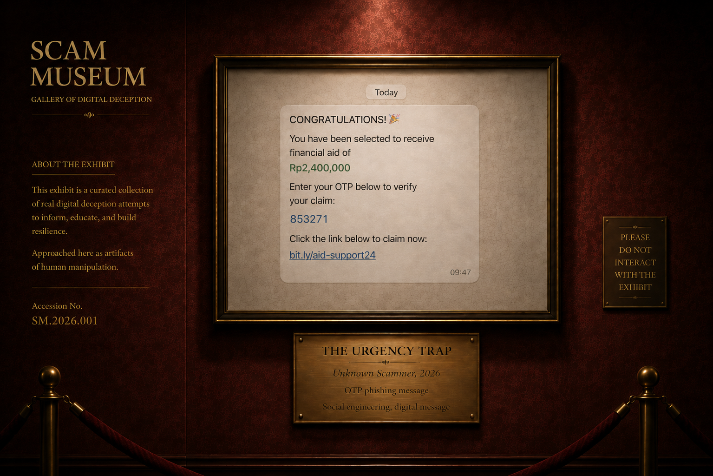

<p align="center">
  
</p>

<p align="center">
  <strong>Gallery of Digital Deception</strong><br>
  Every scam leaves artifacts.
</p>

# Scam Museum

Scam Museum is an AI-powered web experience for examining suspicious digital messages as artifacts of deception.

Paste a message or upload a screenshot. Scam Museum extracts the text, produces an ML risk signal, catalogs observable scam behaviors, handles ambiguity explicitly, and turns the result into a museum-style exhibit that can be shared as an image.

The project was built for **HackSocial 2026 · AI/ML Track**.



## Why a museum?

Most scam detectors stop at a binary answer: scam or not scam.

Scam Museum is built around a different question:

> **What observable artifacts make this message risky?**

A suspicious message is treated like an exhibit. The system separates the statistical ML signal from deterministic evidence such as OTP requests, money-transfer requests, suspicious links, impersonation cues, urgency, and executable attachments.

That separation matters because the model is useful, but it is not an oracle. Human communication is annoyingly fond of context.

## What it does

- Analyze pasted suspicious messages.
- Accept screenshots through file upload.
- Accept screenshots pasted directly from the clipboard with `Ctrl+V`.
- Run in-browser OCR with **Tesseract.js** and let the user review or correct extracted text before analysis.
- Produce a frozen **v0.5 ML risk signal**: `WEAK`, `ELEVATED`, or `STRONG`.
- Detect observable scam evidence independently from the ML classifier.
- Highlight the exact text fragments that triggered evidence rules.
- Resolve the final result through **evidence + protective evidence + uncertainty**, not ML score alone.
- Return one of four user-facing assessments: `LOW RISK`, `INSUFFICIENT EVIDENCE`, `SUSPICIOUS`, or `HIGH RISK`.
- Generate a museum-style exhibit title and curatorial note.
- Export the result as a shareable exhibit card.

## How it works

```text
Text input ─────────────────────────────┐
                                       │
Screenshot upload / clipboard paste    │
        │                              │
        └── Tesseract.js OCR ──────────┤
                                       ▼
                              Reviewed message text
                                       │
                         ┌─────────────┴─────────────┐
                         │                           │
                         ▼                           ▼
                 ML v0.5 risk signal       Deterministic evidence
                 WEAK / ELEVATED /         + protective evidence
                 STRONG                    + context checks
                         │                           │
                         └─────────────┬─────────────┘
                                       ▼
                              Decision / uncertainty
                                       │
                  ┌────────────────────┼────────────────────┐
                  ▼                    ▼                    ▼
              LOW RISK        INSUFFICIENT EVIDENCE    SUSPICIOUS
                                                           │
                                                           ▼
                                                       HIGH RISK
                                       │
                                       ▼
                              Museum-style exhibit
                                       │
                                       ▼
                               Shareable image card
```

## Decision model

Scam Museum deliberately does **not** use the classifier as the final scam/legitimate judge.

The runtime combines four things:

1. the frozen ML text-risk signal;
2. observable positive evidence;
3. protective or counter-evidence;
4. explicit uncertainty.

The final verdict contract is:

| Verdict | Meaning |
|---|---|
| `LOW RISK` | No material scam request was detected. This is not a guarantee that the sender is safe. |
| `INSUFFICIENT EVIDENCE` | The message is ambiguous in isolation and needs more context or independent verification. |
| `SUSPICIOUS` | Meaningful risk signals exist, but the available evidence does not justify a high-risk verdict. |
| `HIGH RISK` | Multiple strong scam behaviors are observable, or a narrowly defined critical interaction request is present. |

The ML score is treated as an **internal risk score, not a calibrated probability**. The UI therefore says things such as `ML Risk Signal: Strong`, not `92% chance this is a scam`.

The complete decision contract lives in [`docs/03_data_eval/EVIDENCE_DECISION_CONTRACT.md`](docs/03_data_eval/EVIDENCE_DECISION_CONTRACT.md).

## Observable evidence

The evidence layer is deterministic and separate from the classifier. Current P0 evidence includes:

### Critical / operational requests

- OTP or security-code requests
- credential requests
- financial-information requests
- gift-card code requests
- executable or installable attachment interaction
- money-transfer requests
- payment or fee requests
- suspicious URL patterns
- reply or call requests

### Threat and manipulation signals

- time urgency
- account threats
- authority claims
- recovery lures
- reward / benefit lures

### Contextual signals

- family impersonation
- new or temporary number claims
- unexpected or wrong-number contact
- job or task solicitation
- piece-rate task payment

### Protective evidence

Messages that explicitly warn the recipient **not** to share an OTP, password, PIN, or security code can reduce risk when no stronger malicious request is present.

Evidence fragments are highlighted in the exhibit so the interface can show *what was observed* without pretending those fragments prove the sender's identity or intent.

## ML model

The frozen runtime classifier is `word_char_balanced_v05`.

It combines:

- word-level TF-IDF, 1–2 grams;
- character `char_wb` TF-IDF, 3–5 grams;
- logistic regression with balanced class weights;
- a frozen decision threshold of **0.80**.

Final training used **12,885 messages**:

| Class | Rows |
|---|---:|
| Legitimate / hard negative | 4,212 |
| Scam-risk | 8,673 |

Model selection was not based on one random accuracy number. Candidates were compared using grouped out-of-fold performance on the primary dataset, leave-one-scam-family-out recall on modern scam data, and leave-one-negative-source-out specificity on legitimate-but-scam-like messages. Only after model and threshold selection was the original primary locked test evaluated.

### Frozen locked-test result

Primary locked test: **1,079 messages** (`967` legitimate, `112` scam-risk).

| Metric | v0.5 |
|---|---:|
| F1 macro | **0.9505** |
| Scam precision | **0.9604** |
| Scam recall | **0.8661** |
| Scam F1 | **0.9108** |
| Specificity | **0.9959** |
| Balanced accuracy | **0.9310** |
| Average precision | **0.9648** |

Confusion matrix:

```text
                 Predicted legit   Predicted scam
Actual legit            963               4
Actual scam              15              97
```

The model report is stored in [`reports/v05/v05_model_selection.json`](reports/v05/v05_model_selection.json).

### Realistic-chat audit

The complete application decision layer was also checked against **24 hand-reviewed realistic chat cases** covering scam-like, ambiguous, and legitimate-like messages.

```text
Review-target matches: 21 / 24
Match rate:            87.5%
```

This is a **behavioral audit match rate, not a claim of population-level model accuracy**. The purpose is to expose brittle decision behavior before submission, including false positives, ambiguous family messages, ordinary money requests, delivery notices, support warnings, and modern task/job scams.

The recorded audit is available in [`reports/realistic_chat_v05_audit.json`](reports/realistic_chat_v05_audit.json).

## Dataset strategy

### Primary dataset

**Mishra & Soni (2022), SMS PHISHING DATASET FOR MACHINE LEARNING AND PATTERN RECOGNITION**  
Mendeley Data · CC BY 4.0  
https://doi.org/10.17632/f45bkkt8pr.1

The source contains `Ham`, `Spam`, and `Smishing` as separate labels. Scam Museum does **not** silently treat all spam as fraud:

```text
Ham      -> LEGITIMATE
Smishing -> SCAM_RISK
Spam     -> excluded from the primary binary target
```

The primary classifier uses message text. URL, email, phone, and similar observable indicators are handled separately by the evidence layer.

### Modern scam-family data

**Agarwal et al. (2025), Fishing for Smishing: Understanding SMS Phishing Infrastructure and Strategies by Mining Public User Reports**  
ACM IMC 2025 · CC BY 4.0  
https://github.com/reportsmishing/Smishing-Dataset-IMC25  
https://doi.org/10.1145/3730567.3764431

The IMC25 corpus is used to challenge and improve generalization across newer scam families rather than being blindly mixed into the original locked benchmark.

### Hard-negative development

Later model versions introduced legitimate messages that superficially resemble scams, including security notices and other difficult negatives. This was necessary because high scam recall alone produced too many false positives on realistic legitimate messages.

The evolution and selection logic are documented under [`docs/`](docs/) and [`reports/`](reports/).

## OCR

Screenshot OCR runs in the browser using **Tesseract.js 5.1.1**.

Accepted image formats:

```text
PNG
JPEG / JPG
WebP
```

Maximum image size: **8 MB**.

The extracted text is placed back into the normal message input. Users are explicitly asked to review and correct OCR mistakes before running analysis. The screenshot itself is not treated as model input; the classifier and evidence engine analyze the reviewed text.

## Shareable exhibits

After analysis, `Share exhibit` renders the result into a museum-style image card. The card keeps the visual identity of the application while reducing the result to its useful public-facing pieces: exhibit title, assessment, message artifact, evidence, and curatorial note.

The feature uses browser-side rendering, so sharing does not require storing the analyzed message on a server.

## Tech stack

| Layer | Technology |
|---|---|
| Backend | FastAPI |
| ML | scikit-learn |
| Model | TF-IDF + Logistic Regression |
| Numerical runtime | NumPy / SciPy |
| Model serialization | joblib |
| Frontend | HTML, CSS, vanilla JavaScript |
| OCR | Tesseract.js 5.1.1 |
| Testing | pytest |
| Python | 3.12.x |
| Deployment target | Vercel |

## Run locally

### 1. Clone

```bash
git clone https://github.com/panjiaryasoma/Scam-Museum.git
cd Scam-Museum
```

### 2. Create the Python environment

Using [`uv`](https://docs.astral.sh/uv/):

```bash
uv python install 3.12.7
uv venv --python 3.12.7
```

### 3. Install application dependencies

```bash
uv pip install -r requirements-app.txt
```

For evaluation and tests as well:

```bash
uv pip install -r requirements-eval.txt -r requirements-test.txt
```

### 4. Run the app

```bash
uv run uvicorn app.main:app --reload
```

Open:

```text
http://127.0.0.1:8000
```

## Testing

Run the full suite with:

```bash
uv run pytest -q
```

Final local verification before README freeze:

```text
199 passed
```

The suite covers the API, evidence rules, risk decisions, ambiguity behavior, hardened exhibit titles, OCR front-end integration, and other regression contracts.

## Project structure

```text
Scam-Museum/
├── api/
│   └── index.py                 # serverless entry point
├── app/
│   ├── core/
│   │   ├── evidence.py          # deterministic evidence extraction
│   │   ├── evidence_context.py  # contextual evidence rules
│   │   ├── exhibit.py           # exhibit title / presentation logic
│   │   ├── inference.py         # frozen model loading and scoring
│   │   ├── risk.py              # final evidence + uncertainty decision
│   │   └── service.py           # analysis orchestration
│   ├── static/
│   │   ├── assets/              # Scam Museum brand assets
│   │   ├── css/
│   │   └── js/                  # app, OCR, and share-card behavior
│   ├── templates/
│   │   └── index.html
│   └── main.py
├── data/
│   ├── processed/
│   └── samples/
├── docs/                        # contracts, design decisions, evaluation notes
├── ml/                          # training and evaluation code
├── models/                      # frozen runtime model + metadata
├── reports/                     # model-selection and behavioral audit records
├── scripts/                     # data preparation and audit utilities
├── submission/                  # Devpost/submission material
├── tests/                       # automated regression suite
├── pyproject.toml
├── requirements.txt
├── requirements-app.txt
├── requirements-eval.txt
├── requirements-test.txt
└── vercel.json
```

## API

The web interface uses the same analysis service exposed by the application API.

Core analysis endpoint:

```text
POST /api/analyze
```

Conceptual request:

```json
{
  "message": "Your account will be suspended. Send your OTP now."
}
```

The response contains the final verdict, ML signal, detected evidence, reason codes, and exhibit metadata used by the front end.

## Design principles

Scam Museum follows a few rules that are intentionally stricter than a flashy demo needs to be:

- **ML is a signal, not the verdict.**
- **Observable evidence stays separate from model inference.**
- **Ambiguity is allowed.** A message can remain unresolved instead of being forced into scam or legitimate.
- **Low risk is not verified safe.**
- **A highlighted phrase is evidence of text behavior, not proof of sender identity.**
- **No live URL reputation is invented.** URL handling uses deterministic local rules only.
- **No attachment is claimed malicious without inspection.** The system only reacts to observable requests to interact with risky executable/installable file types.

## Limitations

Scam Museum is a hackathon prototype and should not be treated as a production fraud-verification service.

- The model is English-first and is primarily trained around SMS / short-message behavior.
- The system analyzes supplied text, not the sender, account, domain owner, or surrounding real-world event.
- OCR can introduce transcription errors, especially on noisy, cropped, stylized, or low-resolution screenshots.
- The ML score is not calibrated as a probability.
- No live URL reputation or domain-intelligence service is queried.
- Attachment contents are not opened or inspected.
- Conversation context can change the meaning of otherwise suspicious phrases.
- `LOW RISK` means the available text did not contain enough material scam evidence. It does not certify safety.

## Documentation

Key project records include:

- [`SCAM_MUSEUM_PROBLEM_BRIEF_v0.1.md`](SCAM_MUSEUM_PROBLEM_BRIEF_v0.1.md)
- [`SCAM_MUSEUM_SIMPLE_PRD_v0.1.md`](SCAM_MUSEUM_SIMPLE_PRD_v0.1.md)
- [`SCAM_MUSEUM_DATASET_LABEL_STRATEGY_v0.1.md`](SCAM_MUSEUM_DATASET_LABEL_STRATEGY_v0.1.md)
- [`docs/03_data_eval/EVIDENCE_DECISION_CONTRACT.md`](docs/03_data_eval/EVIDENCE_DECISION_CONTRACT.md)
- [`reports/v05/v05_model_selection.json`](reports/v05/v05_model_selection.json)
- [`reports/realistic_chat_v05_audit.json`](reports/realistic_chat_v05_audit.json)

---

<p align="center">
  <strong>Scam Museum</strong><br>
  Every scam leaves artifacts.
</p>
